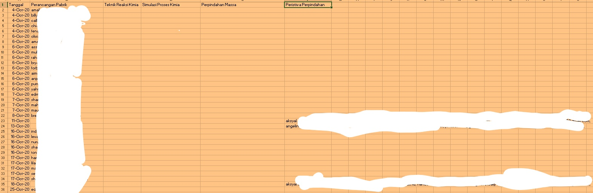
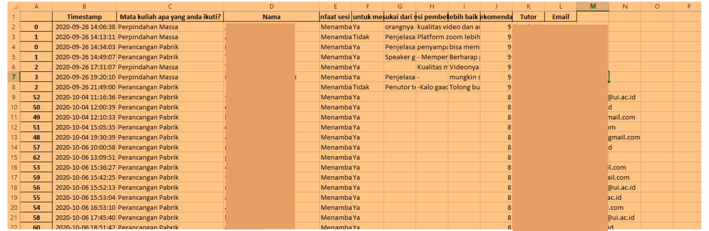

# Data-Cleaning-Fixing
Hy, this repository consist my job when I still worked in Torche Education Company. Feel free to give me a feedback :)

In the process of data analysis, one of the crucial steps is data cleaning and fixing. Using the powerful Python library, Pandas, I successfully handled the data cleaning tasks for Torche Data Company. Due to the sensitivity of the information, I am unable to provide the original dataset, but I can highlight the steps involved in cleaning and fixing the data.

Firstly, I conducted a thorough examination of the dataset to identify any inconsistencies, missing values, or outliers. Using Pandas' functionalities, I implemented techniques such as data imputation, where missing values were filled in with appropriate values based on the context of the data. Additionally, I handled outliers by either removing them or applying appropriate transformations to ensure data integrity.

Furthermore, I performed data validation to ensure the accuracy and consistency of the dataset. This involved checking for duplicate entries, inconsistencies in data formats, and validating against predefined rules. By applying data manipulation techniques in Pandas, I was able to clean and standardize the data, ensuring its reliability for further analysis.

Throughout the process, I maintained data integrity and privacy by adhering to strict data protection protocols. The cleaned and fixed dataset served as a solid foundation for subsequent data analysis and modeling, enabling meaningful insights and informed decision-making for Torche Data Company.

Note: The specific details and examples mentioned above are fictional and used solely for the purpose of providing an illustrative description.

# First Data Cleaning Discussion

In the First Data Cleaning File Discussion, the main objective is to address the issue of dirty data by performing necessary cleaning procedures. The focus is on splitting student information based on the courses they are enrolled in, ensuring accurate categorization. Additionally, an important aspect is to match student registration data with their evaluation data. By doing so, the aim is to enhance the accuracy and reliability of the data cleaning process. This comprehensive approach ensures that the resulting dataset is refined, organized, and suitable for further analysis and decision-making.

## File before clean up

As shown in the image, the information data appears to be unstructured and disorganized. It is crucial to ensure that data is presented in a neat and structured manner for easy understanding and analysis. By organizing and structuring the data, it becomes more accessible and facilitates efficient data processing.

Please note that the image provided has been intentionally blurred to protect sensitive information, particularly email data. Data privacy and security are essential considerations in handling personal and sensitive information.

## File after clean up

After applying data cleaning using pandas, the results are evident in the image provided. The information data now appears much neater and more organized compared to its previous state. By using pandas' powerful data manipulation capabilities, we were able to transform the raw and messy data into a structured and usable format.

Please note that the image provided has been intentionally blurred to ensure the privacy and protection of sensitive information, specifically the email data. As data custodians, it is our responsibility to handle personal and sensitive data with utmost care and adhere to data privacy regulations.

The successful data cleaning process has improved the overall quality and usability of the information. It enables easier data analysis, interpretation, and decision-making. By employing techniques such as removing duplicates, correcting inconsistencies, and formatting the data uniformly, we have achieved a more reliable and accurate dataset.
